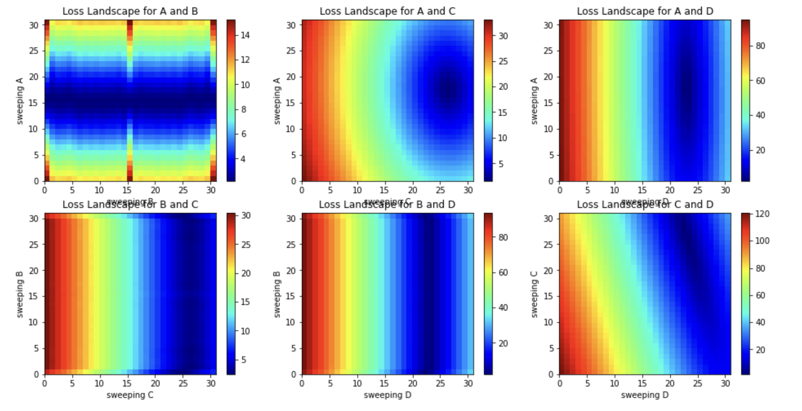

# EE399. 
# introduction to machine learning. 
# HW1. 

## curve fitting with line, parabola, and 19th degree polynomial. 
Author: Arvin Nusalim. 

Abstruct: Given the data, we tried to find the least-squares error and the parameters for that. Then we fix two of the parameters and sweep through values of the other two parameters to generate a 2D loss (error) landscape. do this for every combinations. some of the data are used to train the model and the rest are used to test the model. The model are used are line, parabola, and 19th degree polynomial.  

## I. Introduction and Overview.   
This project's objective are to use the given data to find the least-squares error and parameters, find the local minimum when 2 of the parameter are sweep through and 2 of them are fixed. least-squares error is a method used to determine the line of best fit for the data. We are using the least-squares error with a few function to find which one is the best fit for the data. 
   
## II. Theoritical Background. 
In this section, we will provide a brief theoretical background on the functions that we will be using to find the least-squares error. The first function, $f(x) = A\cos(Bx) + Cx + D$, is a combination of a cosine wave and a linear function. This function can be used if the given data looks like a wave with a slope.

The second function, $f(x) = Ax + B$, is a simple linear function that is commonly used if the given data looks like a line.

The third function, $f(x) = Ax^2 + Bx + C$, is a quadratic function that is commonly used if the given data looks like a parabola.

The fourth function, $f(x) = 19^{th}$ degree polynomial, is a polynomial function that can be used if the given data have a lot of curves (local minimum and maximum), up to 18 local minimum and maximum. The degree of the polynomial determines the number of coefficients that are needed to define the function, and higher-degree polynomials can capture more complex patterns in the data.

By using the least-squares error formula ( $E = \sqrt{(1/n)\Sigma_{j=1}^n(f(x_j)-y_j)^2}$  ) with these functions, we can determine which function provides the best fit for a given set of data. The least-squares error measures the distance between the predicted values of the function and the actual values of the data, and seeks to minimize this distance by adjusting the parameters of the function. By plotting the curve fit and comparing it to the original data, we can visually assess the quality of the fit and determine whether the function provides a good representation of the underlying relationship between the variables.

## III. Algorithm Implementation and Development. 
### Finding the minimum error and parameter
By creating a fuction for the least-squares error using the first formula,
```
def velfit(c, x, y):
    e2 = np.sqrt(1/(x.size)*np.sum((c[0]*np.cos(c[1]*x)+c[2]*x+c[3]-y)**2))
    return e2
```
and v0 as an array of parameter, we can use the following to find the minimum optimized parameter (c).
```
res= opt.minimize(velfit, v0, args=(X, Y), method='Nelder-Mead')
c = res.x
```
we can find the minimum error using the velvit function with c as the parameter. we can then fit the parameter (c) to the first formula and plot the curve fit.

### 2D loss (error) landscape
to find the local minima, fix two of the parameters and sweep through values of the other two parameters by using np.linspace to generate a 2D loss (error) landscape. Do all combinations of two fixed parameters and two swept parameters, and visualize it using grid. 

we can now visually see the local minima (the dark color at loss landscape A and C).

### Training data
for the first set, we are using the first 20 data point as training data and for the second set we are using the first 10 and last 10 data point as training data, we repeat the process as when finding the minumum error and parameter, but using a different formula. 
for the line fit, we use
``` 
def velfitline(c, x, y):
    e2 = np.sqrt(1/(x.size)*np.sum((c[0]*x+c[1]-y)**2))
    return e2
```
for the parabola fit, we use
```
def velfitparabola(c, x, y):
    e2 = np.sqrt(1/(x.size)*np.sum((c[0]*(x**2)+c[1]*x+c[2]-y)**2))
    return e2
```
and for the 19th degree polynomial, we use
```
def velfitpoly(c, x, y):
    e2 = np.sqrt(1/(x.size)*np.sum((np.polyval(c,x)-y)**2))
    return e2
```
### Test data
we can then compute the least square error of these models on the test data which are
the remaining data points from the first set and second set.


## IV. Computational Results. 
the plot from the training data and the minimum error will looks like this.
for line fit,

for parabola fit, 

for 19th degree polynomial,


## V. Summary and Conclusions. 
