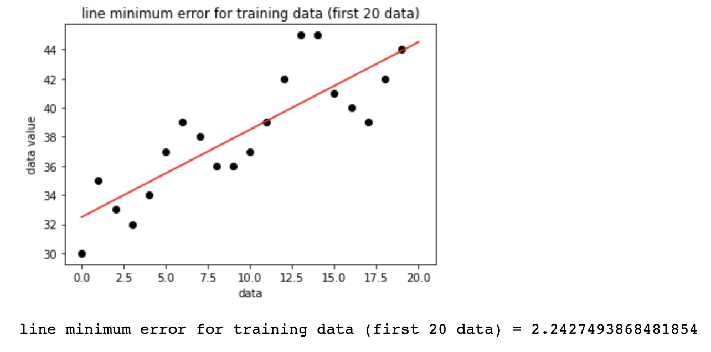
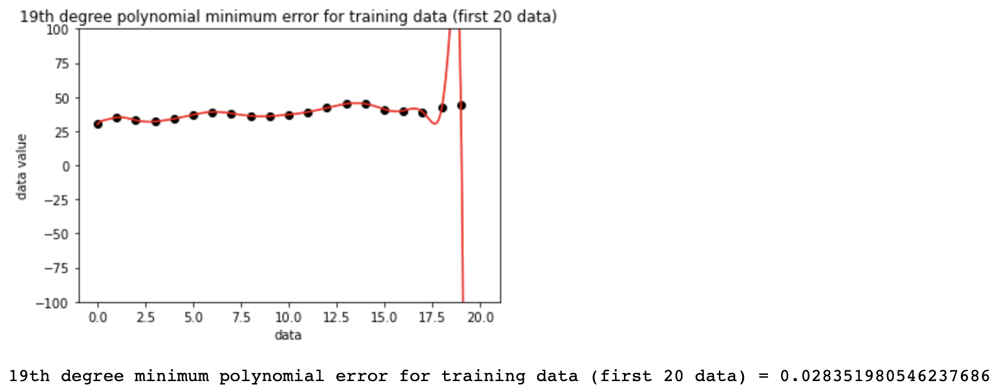
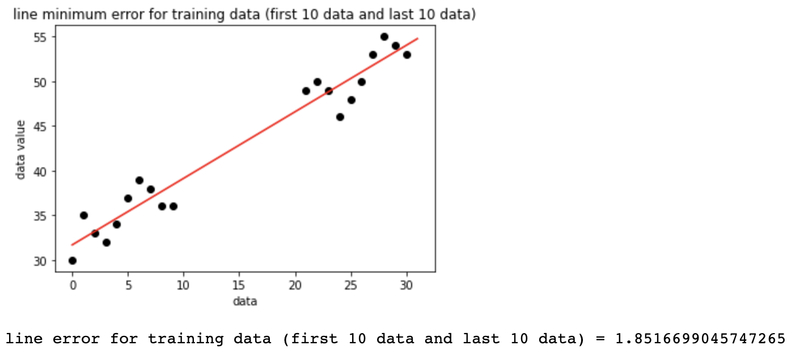
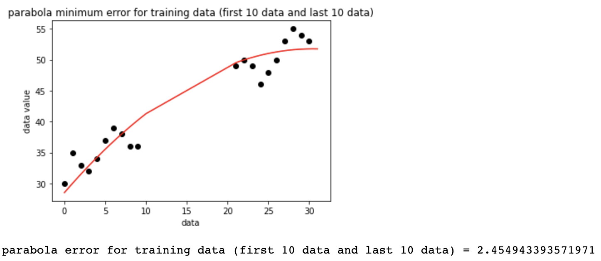
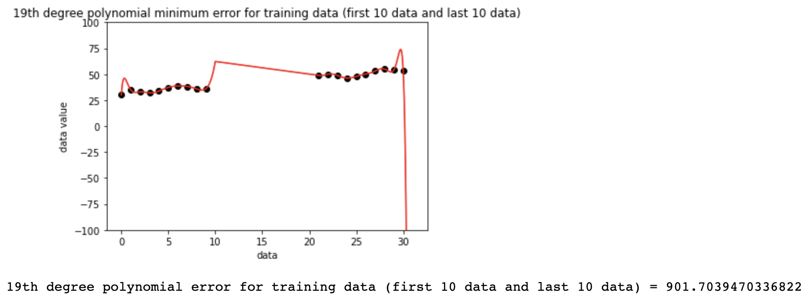

# EE399. 
# introduction to machine learning. 
# HW5. 

## FFNN, LSTM, RNN, ESN for future state prediction on Lorenz equations.
Author: Arvin Nusalim. 

Abstruct: using Feedforward Neural Network, Long Short-term Memory, Recurrent Neural Network, and Echo State Network on Lorenz equations for future state prediction. 

Given the data, we tried to find the least-squares error and the parameters for that. Then we fix two of the parameters and sweep through values of the other two parameters to generate a 2D loss (error) landscape. do this for every combinations. some of the data are used to train the model and the rest are used to test the model. The model are used are line, parabola, and 19th degree polynomial.  

## I. Introduction and Overview.   
This project's objective are to use the given data to find the least-squares error and parameters, find the local minimum when 2 of the parameter are sweep through and 2 of them are fixed. least-squares error is a method used to determine the line of best fit for the data. We are using the least-squares error with a few function to find which one is the best fit for the data. 
   
## II. Theoritical Background.
In this section, we will provide a brief theoretical background on Feedforward Neural Network (FFNN), Long Short-term Memory (LSTM), Recurrent Neural Network (RNN), and Echo State Network (ESN).

### 1. Feedforward Neural Network (FFNN)
A Feedforward Neural Network (FFNN) is a type of machine learning model that takes input and produces output in a single direction, with multiple layers of interconnected neurons in between. It's commonly used for tasks like predicting a label for an input. During training, the network adjusts its weights and biases to better match the desired output.

### 2. Long Short-term Memory (LSTM)
Long Short-Term Memory (LSTM) is a type of neural network that is good at handling sequential data like text or speech. It has a special memory cell that can store information over time and three different types of gates to control the flow of information. LSTM networks can remember or forget information as needed and are commonly used for natural language processing and speech recognition.

### 3.  Recurrent Neural Network (RNN)
Recurrent Neural Network (RNN) is a type of neural network commonly used for tasks involving sequences of data. It can remember previous inputs by using a hidden state, allowing it to learn patterns or dependencies in sequential data. RNNs are useful for tasks like language processing and time series prediction. However, they have difficulty capturing long-term dependencies.

### 4. Echo State Network (ESN)
An Echo State Network (ESN) is a type of recurrent neural network (RNN) that is known for its simplicity and effectiveness in handling sequential data. It uses randomly initialized connections that remain fixed during training, while only the connections between input and output layers are learned. This fixed random initialization creates a reservoir of hidden states, which act as memory for processing sequential data. ESNs are computationally efficient, robust to gradient problems, and have been successfully applied to various tasks such as time series prediction and speech recognition.

## III. Algorithm Implementation and Development. 
### Finding the minimum error and parameter
By creating a fuction for the least-squares error using the first formula,
```
def velfit(c, x, y):
    e2 = np.sqrt(1/(x.size)*np.sum((c[0]*np.cos(c[1]*x)+c[2]*x+c[3]-y)**2))
    return e2
```
and v0 as an array of parameter, we can use the following to find the minimum optimized parameter (c).
```
res= opt.minimize(velfit, v0, args=(X, Y), method='Nelder-Mead')
c = res.x
```
we can find the minimum error using the velvit function with c as the parameter. we can then fit the parameter (c) to the first formula and plot the curve fit.

### 2D loss (error) landscape
to find the local minima, fix two of the parameters and sweep through values of the other two parameters by using np.linspace to generate a 2D loss (error) landscape. Do all combinations of two fixed parameters and two swept parameters, and visualize it using grid. 

we can now visually see the local minima (the dark color at loss landscape A and C).

### Training data
for the first set, we are using the first 20 data point as training data and for the second set we are using the first 10 and last 10 data point as training data, we repeat the process as when finding the minumum error and parameter, but using a different formula. 
for the line fit, we use
``` 
def velfitline(c, x, y):
    e2 = np.sqrt(1/(x.size)*np.sum((c[0]*x+c[1]-y)**2))
    return e2
```
for the parabola fit, we use
```
def velfitparabola(c, x, y):
    e2 = np.sqrt(1/(x.size)*np.sum((c[0]*(x**2)+c[1]*x+c[2]-y)**2))
    return e2
```
and for the 19th degree polynomial, we use
```
def velfitpoly(c, x, y):
    e2 = np.sqrt(1/(x.size)*np.sum((np.polyval(c,x)-y)**2))
    return e2
```
### Test data
we can then compute the least square error of these models on the test data which are
the remaining data points from the first set and second set.


## IV. Computational Results. 
the plot from the training data and the minimum error for the first set will looks like this.
for line fit,

for parabola fit, 

for 19th degree polynomial,


and the minimum error for the first test data are 14.979185421781299, 14.918659032328, and 175.51127228413117 consecutively.

the plot from the training data and the minimum error for the second set will looks like this.
for line fit,

for parabola fit, 

for 19th degree polynomial,


and the minimum error for the second test data are 7.011399521824588, 7.514532801924898, and 232.2173477123093 consecutively.

After finding the model for the training data and plug the model to the test data, we can see that in line fit and parabola fit the curve model fit nicely and 19th degree polynomial the model didn't fit. this can be known by checking the minimum error. 

## V. Summary and Conclusions. 
to conclude, by using finding minimum optimized parameter, we can find the least-squares error and check if the curve model fit the test data. we can also visually see the local minima by sweeping through the parameters and plot it using grid. The higher the least-square error or minimum error we got for the test data using the model from the training data, the less fit the curve model will be for the data. instead, the lower the least-squares error or minimum error we got for the test data using the model from the training data, the curve model will fit better in the test data.
