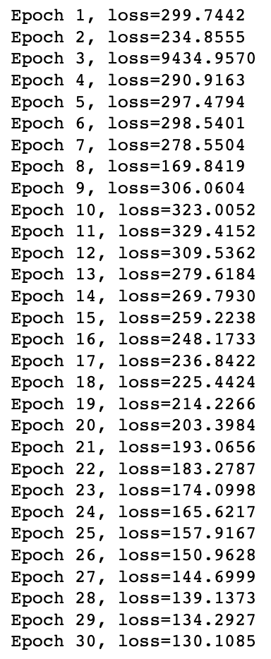
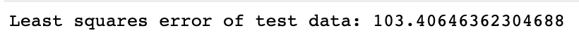
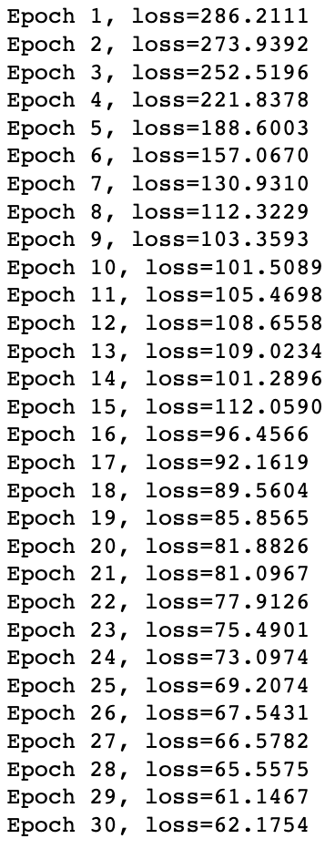
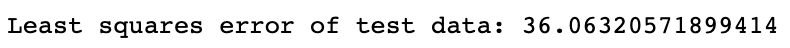
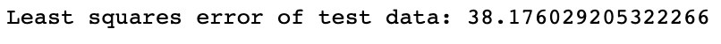
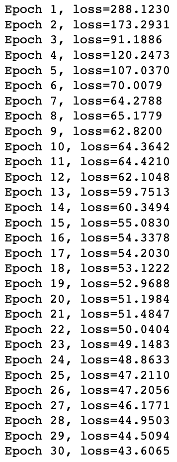
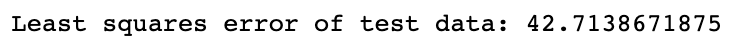

# EE399. 
# introduction to machine learning. 
# HW6. 

## Sea-surface temperature
Author: Arvin Nusalim. 

Abstruct: Given the sea surface temperature data from https://github.com/shervinsahba/pyshred github, train the model with LSTM and do an analysis of the performance as a function of the time lag variable, noise, and number of sensors.

## I. Introduction and Overview.   
This project's objective are to do analysis on the given data by changing the time lag variable, analysis after adding gaussian noise to the data, and analysis by changing the number of sensors. 
   
## II. Theoritical Background.
In this section, we will provide a brief theoretical background on Long Short-term Memory (LSTM), time lag variable, and gaussian noise.

### 1. Long Short-term Memory (LSTM)
Long Short-Term Memory (LSTM) is a type of neural network that is good at handling sequential data like text or speech. It has a special memory cell that can store information over time and three different types of gates to control the flow of information. LSTM networks can remember or forget information as needed and are commonly used for natural language processing and speech recognition.

### 2. Time lag variable
A time lag variable in machine learning is a value from a previous point in time. For example, if you're predicting the weather, today's temperature might be affected by yesterday's temperature. In this case, yesterday's temperature is a time lag variable. It helps capture how things change over time and can improve the accuracy of predictions in time-based data.

### 3.  Gaussian noise
Gaussian noise, also known as normal noise, in machine learning refers to statistical noise having a probability density function (PDF) equal to that of the normal distribution, which is also known as the Gaussian distribution. In other words, it's a type of statistical noise where values are randomly distributed with a mean of 0 and some standard deviation. In machine learning, it's often added to data for several reasons:  
1. Preventing Overfitting: Adding noise can help the model avoid learning too closely from the training data, making it more adaptable to new data.  
2. Improving Robustness: Adding noise, especially in image processing tasks, can help the model perform better even when there's noise in real-world data.  
3. Privacy Protection: Noise can help protect sensitive data by making it harder to identify original inputs.  
4. Model Testing: We can add noise to data to check if our model still performs well under less-than-ideal conditions.  


## III. Algorithm Implementation and Development.
### Necessary import
the necessary import for this project are
```
import numpy as np
from processdata import load_data
from processdata import TimeSeriesDataset
import models
import torch
import matplotlib.pyplot as plt
from sklearn.preprocessing import MinMaxScaler
```
### Load the data and set the parameter
```
num_sensors = 3 
lags = 52
load_X = load_data('SST')
n = load_X.shape[0]
m = load_X.shape[1]
sensor_locations = np.random.choice(m, size=num_sensors, replace=False)
```

### prepare the data
prepare the data using the code below.  
```
train_indices = np.random.choice(n - lags, size=1000, replace=False)
mask = np.ones(n - lags)
mask[train_indices] = 0
valid_test_indices = np.arange(0, n - lags)[np.where(mask!=0)[0]]
valid_indices = valid_test_indices[::2]
test_indices = valid_test_indices[1::2]

sc = MinMaxScaler()
sc = sc.fit(load_X[train_indices])
transformed_X = sc.transform(load_X)

### Generate input sequences to a SHRED model
all_data_in = np.zeros((n - lags, lags, num_sensors))
for i in range(len(all_data_in)):
    all_data_in[i] = transformed_X[i:i+lags, sensor_locations]

### Generate training validation and test datasets both for reconstruction of states and forecasting sensors
device = 'cuda' if torch.cuda.is_available() else 'cpu'

train_data_in = torch.tensor(all_data_in[train_indices], dtype=torch.float32).to(device)
valid_data_in = torch.tensor(all_data_in[valid_indices], dtype=torch.float32).to(device)
test_data_in = torch.tensor(all_data_in[test_indices], dtype=torch.float32).to(device)

### -1 to have output be at the same time as final sensor measurements
train_data_out = torch.tensor(transformed_X[train_indices + lags - 1], dtype=torch.float32).to(device)
valid_data_out = torch.tensor(transformed_X[valid_indices + lags - 1], dtype=torch.float32).to(device)
test_data_out = torch.tensor(transformed_X[test_indices + lags - 1], dtype=torch.float32).to(device)

train_dataset = TimeSeriesDataset(train_data_in, train_data_out)
valid_dataset = TimeSeriesDataset(valid_data_in, valid_data_out)
test_dataset = TimeSeriesDataset(test_data_in, test_data_out)
```
### Train the data
```
shred = models.SHRED(num_sensors, m, hidden_size=64, hidden_layers=2, l1=350, l2=400, dropout=0.1).to(device)
validation_errors = models.fit(shred, train_dataset, valid_dataset, batch_size=64, num_epochs=50, lr=1e-3, verbose=True, patience=5)
```
### Test the data
```
test_recons = sc.inverse_transform(shred(test_dataset.X).detach().cpu().numpy())
test_ground_truth = sc.inverse_transform(test_dataset.Y.detach().cpu().numpy())
print(np.linalg.norm(test_recons - test_ground_truth) / np.linalg.norm(test_ground_truth))
```
### Plot the data
to plot the data, first we need to reshape it.  
```
from processdata import load_full_SST

# SST data with world map indices for plotting
full_SST, sst_locs = load_full_SST()
full_test_truth = full_SST[test_indices, :]

# replacing SST data with our reconstruction
full_test_recon = full_test_truth.copy()
full_test_recon[:,sst_locs] = test_recons

# reshaping to 2d frames
for x in [full_test_truth, full_test_recon]:
    x.resize(len(x),180,360)
```
after reshaping, we can plot the map using the given code.
```
plotdata = [full_test_truth, full_test_recon]
labels = ['truth','recon']
fig, ax = plt.subplots(1,2,constrained_layout=True,sharey=True)
for axis,p,label in zip(ax, plotdata, labels):
    axis.imshow(p[0])
    axis.set_aspect('equal')
    axis.text(0.1,0.1,label,color='w',transform=axis.transAxes)
```

### Analysis of the performance as a function of the time lag variable
for analysis of the performance as a function of the time lag variable, it is pretty much the same as the previous code. the only difference is we use different time lags.
```
time_lags = [1, 20, 40, 52, 70, 90]
```
we prepare, train, and test the data in a loop with different time lags each iteration.
### Analysis of the performance as a function of noise (add Gaussian noise to data)


### Analysis of the performance as a function of the number of sensors


## IV. Computational Results.
after training the model with FFNN, we got the following data    
   
and after testing the model, we got the following data      
    

for LSTM,    
 
 

RNN,    
 
 

and ESN.   
 
 
## V. Summary and Conclusions.
to conclude, all of the model works amazingly in the lorenz equations. but, some of them are not stable and some of them took a lot of time. The best model between FFNN, LSTM, RNN, and ESN are LSTM. not only it has the best least square error when testing the data, it didn't took a long time to run it. For FFNN, although the computation was fast, there are a little bit of spike on the least square error. For RNN, although the least square error was good, it took really long time to compute. lastly, for ESN, the result was better compared with FFNN in term of the least square error, but compare to LSTM, ESN was a little bit below it.
