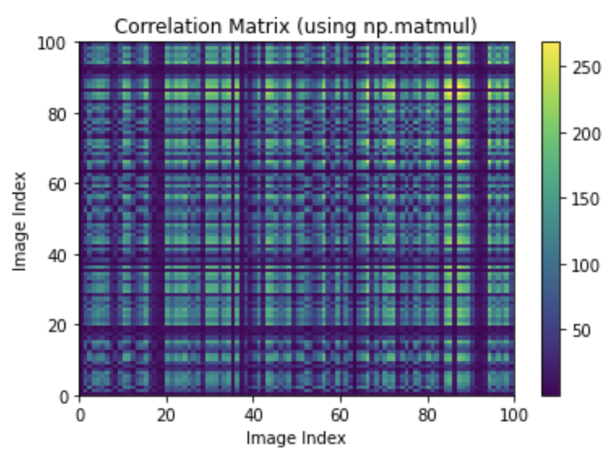
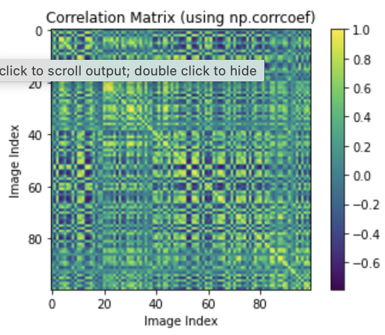

# EE399. 
# introduction to machine learning. 
# HW2. 

## SVD and yalefaces. 
Author: Arvin Nusalim. 

Abstruct: given the data of 39 different faces with about 65 lighting scenes for each face, we tried to find the highly currelated and highly uncorrelated images between the given data. find the first largest 6 eigenvectors from the dot product of X and X transpose, find the 6 pricipal component direction using the SVD of matrix X, and compute the norm of difference of their abolute value. plot the 6 SVD modes after computing the percentage of variance.

## I. Introduction and Overview.   
This project's objective are to use the given data to find and plot the highly correlated images and highly uncorrelated images, compare the eigenvector and SVD modes, and use the first 6 SVD modes to compute the percentage of variance and plot to get the most dominant features. 

## II. Theoritical Background. 
In this section, we will provide a brief theoretical background on SVD. Singular Value Decomposition (SVD) is a method to break down a matrix into 3 parts that describe its most important features which are diagonal matrix ($S$) that measure how important the features and 2 orthogonal matrices ($U$ and $V^T$) that describe the direction of the features.   
     
SVD is usually used in the calculation of other matrix operations, such as matrix inverse, but also as a data reduction method in machine learning.

## III. Algorithm Implementation and Development. 
### compute 100 X 100 orrelation matrix between the first 100 images

The yalafaces data consist of 2414 32X32 pixel images where each images are the column of the matrix making the yalefaces size 1024 × 2414. By taking the first 100 faces using this code,
```
faces100 = X[:,1:101]
```
there are 2 ways on finding the correlation of the matrix. first is by using
```
C100 = np.matmul(faces100.T,faces100)
```
and the second is by using 
```
C100 = np.corrcoef(faces100.T)
```
These are the images from plotting the 2 code above.
     
   
the second code are more preferable because the image are more distinguishable.

### Plot the highly correlated faces and uncorrelated faces
By using these code we can find the index of the maximum and minimum correlation coefficients and plot it.
```
max_idx = np.unravel_index(np.argmax(C100), C100.shape)
min_idx = np.unravel_index(np.argmin(C100), C100.shape)
```
we can turn the column from X matrix into image by using 
```
max_img1 = X[:, max_idx[0]]
max_img2 = X[:, max_idx[1]]
min_img1 = X[:, min_idx[0]]
min_img2 = X[:, min_idx[1]]
```
and finally we can plot the 2 picture for highly correlated and highly uncorrelated by using
```
# Plot the most highly correlated images
fig, ax = plt.subplots(1, 2, figsize=(8, 4))
ax[0].imshow(max_img1.reshape(32, 32), cmap='gray')
ax[0].set_title('Image {}'.format(max_idx[0]+1))
ax[1].imshow(max_img2.reshape(32, 32), cmap='gray')
ax[1].set_title('Image {}'.format(max_idx[1]+1))
plt.show()

# Plot the most uncorrelated images
fig, ax = plt.subplots(1, 2, figsize=(8, 4))
ax[0].imshow(min_img1.reshape(32, 32), cmap='gray')
ax[0].set_title('Image {}'.format(min_idx[0]+1))
ax[1].imshow(min_img2.reshape(32, 32), cmap='gray')
ax[1].set_title('Image {}'.format(min_idx[1]+1))
plt.show()
```
### Compute 10 X 10 correlation matrix between 10 images in a certain index
we can combine the column in the index (1, 313, 512, 5, 2400, 113, 1024, 87, 314, 2005) from X matrix into 1 array using
```
faces10 = np.hstack((X[:,1][:, np.newaxis], X[:,313][:, np.newaxis], X[:,512][:, np.newaxis], X[:,5][:, np.newaxis], X[:,2400][:, np.newaxis], X[:,113][:, np.newaxis], X[:,1024][:, np.newaxis], X[:,87][:, np.newaxis], X[:,314][:, np.newaxis], X[:,2005][:, np.newaxis]))
```
we can then compute the correlation with the steps similar with the 100 X 100 correlation matrix.

### Find the first six eigenvectors with the largest magnitude eigenvalue.

to find the first six eigenvectors with the largest magnitude eigenvalue, we can first compute Y which is the dot product of $X$ and $X^T$. then use
```
eigenvalues, eigenvectors = np.linalg.eig(Y)
```
to find the eigenvalues and eigenvectors. 

use np.argsort to get the sorted index of the eigenavalues in ascending order, then use $[::-1]$ to turn it into descending order, and $[:6]$ to take the first 6 values like the code below.
```
largest_indices = np.argsort(np.abs(eigenvalues))[::-1][:6]
```
we can then sort the eigenvectors using
```
largest_eigenvectors = eigenvectors[:, largest_indices]
```
and finally take the first index as the largest eigenvector.

### Compute the norm of difference of their absolute values and the percentage of variance captured by each of the first 6 SVD modes.

to compute SVD in python, we can use 
```
U, S, Vt = np.linalg.svd(X, full_matrices=False)
```
to get the diagonal matrix ($S$) and 2 orthogonal matrices ($U$ and $V^T$).
Get the first six principal component directions by applying 
```
P = U[:, :6].
```
Compare the first eigenvector v1 with the first SVD mode u1 and compute the norm of difference of their absolute values with the following code.
```
v1 = largest_eigenvectors[:, 0]
u1 = P[:, 0]
abs_diff = np.abs(v1 - u1)
norm_abs_diff = np.linalg.norm(abs_diff)
print(norm_abs_diff)
```
