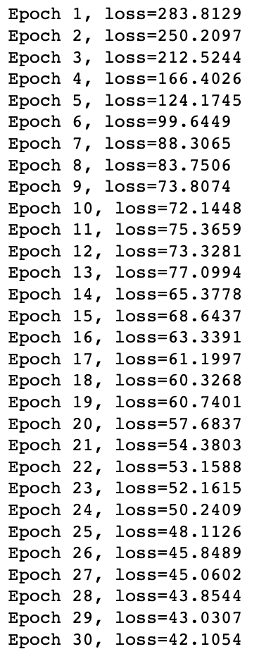

# EE399. 
# introduction to machine learning. 
# HW6. 

## Sea-surface temperature
Author: Arvin Nusalim. 

Abstruct: Given the sea surface temperature data from https://github.com/shervinsahba/pyshred github, train the model with LSTM and do an analysis of the performance as a function of the time lag variable, noise, and number of sensors.

## I. Introduction and Overview.   
This project's objective are to do analysis on the given data by changing the time lag variable, analysis after adding gaussian noise to the data, and analysis by changing the number of sensors. 
   
## II. Theoritical Background.
In this section, we will provide a brief theoretical background on Long Short-term Memory (LSTM), time lag variable, and gaussian noise.

### 1. Long Short-term Memory (LSTM)
Long Short-Term Memory (LSTM) is a type of neural network that is good at handling sequential data like text or speech. It has a special memory cell that can store information over time and three different types of gates to control the flow of information. LSTM networks can remember or forget information as needed and are commonly used for natural language processing and speech recognition.

### 2. Time lag variable
A time lag variable in machine learning is a value from a previous point in time. For example, if you're predicting the weather, today's temperature might be affected by yesterday's temperature. In this case, yesterday's temperature is a time lag variable. It helps capture how things change over time and can improve the accuracy of predictions in time-based data.

### 3.  Gaussian noise
Gaussian noise is a type of random noise that follows a bell-shaped curve, also known as a Gaussian distribution. In machine learning, it's often added to data for several reasons:  
1. Preventing Overfitting: Adding noise can help the model avoid learning too closely from the training data, making it more adaptable to new data.  
2. Improving Robustness: Adding noise, especially in image processing tasks, can help the model perform better even when there's noise in real-world data.  
3. Privacy Protection: Noise can help protect sensitive data by making it harder to identify original inputs.  
4. Model Testing: We can add noise to data to check if our model still performs well under less-than-ideal conditions.  


## III. Algorithm Implementation and Development.
### Necessary import
the necessary import for this project are
```
import numpy as np
import matplotlib.pyplot as plt
from scipy import integrate
import torch
import torch.nn as nn
import torch.optim as optim
```

### Fit the Feedforward Neural Network
Firstly, we need to create a Feedforward Neural Network.
```
class Net(nn.Module):
    def __init__(self):
        super(Net, self).__init__()
        self.fc1 = nn.Linear(3, 15)
        self.fc2 = nn.Linear(15, 6)
        self.fc3 = nn.Linear(6, 3)

    def forward(self, x):
        x = torch.relu(self.fc1(x))
        x = torch.relu(self.fc2(x))
        x = self.fc3(x)
        return x
```
Initialize the network and define the loss function and optimizer. we are using the nn.MSELoss to compute the mean square error or least square error.
```
model = Net()
criterion = nn.MSELoss()
optimizer = optim.SGD(model.parameters(), lr=0.01, momentum=0.9)
```
### define the parameter
```
# Define hyperparameters
dt = 0.01
T = 8
t = np.arange(0,T+dt,dt)
beta = 8/3
sigma = 10
# Given rho values to train and test
rho_values_train = [10, 28, 40]
rho_values_test = [17, 35]
```
### prepare the data to train
we need to insert the $\rho$ = 10, 28 and 40 to train the model. 
```
# Define the NN input and output
nn_input = np.zeros((100*(len(t)-1),3))
nn_output = np.zeros_like(nn_input)

# Create a list for input and output for the neural network (after data preparation)
nn_input_final = []
nn_output_final = []

# Data preparation
for rho in rho_values_train:
    
    # Define the Lorenz equation
    def lorenz_deriv(x_y_z, t0, sigma=sigma, beta=beta, rho=rho):
        x, y, z = x_y_z
        return [sigma * (y - x), x * (rho - z) - y, x * y - beta * z]

    np.random.seed(123)
    x0 = -15 + 30 * np.random.random((100, 3))

    x_t = np.asarray([integrate.odeint(lorenz_deriv, x0_j, t)
                      for x0_j in x0])
    
    for j in range(100):
        nn_input[j*(len(t)-1):(j+1)*(len(t)-1),:] = x_t[j,:-1,:]
        nn_output[j*(len(t)-1):(j+1)*(len(t)-1),:] = x_t[j,1:,:]
        
    # Convert numpy arrays to PyTorch tensors
    nn_input_tensor = torch.from_numpy(nn_input).float()
    nn_output_tensor = torch.from_numpy(nn_output).float()
    
    # Appending the tensors to a list
    nn_input_final.append(nn_input_tensor)
    nn_output_final.append(nn_output_tensor)
    

# Concatenate the neural network input and outputs from each rho values
nn_in = torch.cat(nn_input_final)
nn_out = torch.cat(nn_output_final)
```
### train the model
```
for epoch in range(30):
    optimizer.zero_grad()
    outputs = model(nn_in)
    loss = criterion(outputs, nn_out)
    loss.backward()
    optimizer.step()
    print(f"Epoch {epoch+1}, loss={loss.item():.4f}")
```
### prepare the data to test
we need to insert the $\rho$ = 17 and 35 to test the model. 
```
nn_input_test_final = []
nn_output_test_final = []

# Test the network with given test rho values
for rho in rho_values_test:
    
    # Define the Lorenz equation
    def lorenz_deriv(x_y_z, t0, sigma=sigma, beta=beta, rho=rho):
        x, y, z = x_y_z
        return [sigma * (y - x), x * (rho - z) - y, x * y - beta * z]

    np.random.seed(123)
    x0 = -15 + 30 * np.random.random((100, 3))

    x_t = np.asarray([integrate.odeint(lorenz_deriv, x0_j, t)
                      for x0_j in x0])
    
    for j in range(100):
        nn_input[j*(len(t)-1):(j+1)*(len(t)-1),:] = x_t[j,:-1,:]
        nn_output[j*(len(t)-1):(j+1)*(len(t)-1),:] = x_t[j,1:,:]
        
    # Convert numpy arrays to PyTorch tensors
    nn_in_test_tensor = torch.from_numpy(nn_input).float()
    nn_out_test_tensor = torch.from_numpy(nn_output).float()
    
    # Appending the tensors to a list
    nn_input_test_final.append(nn_in_test_tensor)
    nn_output_test_final.append(nn_out_test_tensor)
    
# Concatenate the neural network input and outputs from each rho values
nn_in_test = torch.cat(nn_input_test_final)
nn_out_test = torch.cat(nn_output_test_final)
```
### test the model
```
# Test the network
with torch.no_grad():
    outputs = model(nn_in_test)
    compute_mse = criterion(outputs, nn_out_test)

    print('Least squares error of test data: {}'.format(compute_mse.item()))
```
### fit the Long Short term Memory, train, and test the model
the data preparation for Long Short term Memory is the same as Feedforward Neural Network. the only things that is different are the model. instead of using FFNN, we use LSTM.
```
# Create an LSTM neural network architecture
class LSTMNet(nn.Module):
    def __init__(self, input_size=3, hidden_size=15, num_layers=1, output_size=3):
        super(LSTMNet, self).__init__()
        self.hidden_size = hidden_size
        self.num_layers = num_layers
        
        self.lstm = nn.LSTM(input_size, hidden_size, num_layers, batch_first=True)
        self.fc = nn.Linear(hidden_size, output_size)

    def forward(self, x):
        # Initialize hidden and cell states
        h0 = torch.zeros(self.num_layers, self.hidden_size)
        c0 = torch.zeros(self.num_layers, self.hidden_size)
        
        # LSTM layer
        out, _ = self.lstm(x, (h0, c0))
        
        # Fully connected layer
        out = self.fc(out[:, :])
        
        return out
```
The initialization of th network is also different.
```
device = torch.device('cuda' if torch.cuda.is_available() else 'cpu')
model = LSTMNet().to(device)
```
### fit the Recurrent Neural Network, train, and test the model
Perform the same things like FFNN and LSTM for RNN after changing the model and initialization of the network.
```
# Create an RNN neural network architecture
class RNNNet(nn.Module):
    def __init__(self, input_size=3, hidden_size=15, num_layers=1, output_size=3):
        super(RNNNet, self).__init__()
        self.hidden_size = hidden_size
        self.num_layers = num_layers
        
        self.rnn = nn.RNN(input_size, hidden_size, num_layers, batch_first=True)
        self.fc = nn.Linear(hidden_size, output_size)

    def forward(self, x):
        # Initialize hidden state
        h0 = torch.zeros(self.num_layers, self.hidden_size)
        
        # RNN layer
        out, _ = self.rnn(x, h0)
        
        # Fully connected layer
        out = self.fc(out[:, :])  # Use the last output timestep
        
        return out
        
# Create model instance
model = RNNNet()
```
### fit the Echo State Network, train, and test the model
For Echo State Network, although the data preparation is the same, the training and testing model are slightly different.
For the model and network initialization, we can use the code below.
```
class ESN(nn.Module):
    def __init__(self, input_size=3, reservoir_size=100, output_size=3):
        super(ESN, self).__init__()
        self.input_size = input_size
        self.reservoir_size = reservoir_size
        self.output_size = output_size
        
        # Reservoir layer
        self.reservoir = nn.Linear(input_size + reservoir_size, reservoir_size)
        
        # Output layer
        self.output = nn.Linear(reservoir_size, output_size)

    def forward(self, x, reservoir_state):
        # Concatenate input with reservoir state
        combined_input = torch.cat([x, reservoir_state], dim=1)
        
        # Reservoir layer
        reservoir_output = torch.tanh(self.reservoir(combined_input))
        
        # Output layer
        output = self.output(reservoir_output)
        
        return output, reservoir_output
        
# Create model instance
model = ESN(input_size=3, reservoir_size=100, output_size=3)
```
To train the model, we can use this
```
# Train the model
for epoch in range(30):
    optimizer.zero_grad()
    reservoir_state = torch.zeros(nn_in.size(0), model.reservoir_size)
    outputs, _ = model(nn_in, reservoir_state)
    loss = criterion(outputs, nn_out)
    loss.backward()
    optimizer.step()
    print(f"Epoch {epoch + 1}, loss={loss.item():.4f}")
```
and to test it, we can use
```
# Evaluation
reservoir_state = torch.zeros(nn_in_test.size(0), model.reservoir_size)
with torch.no_grad():
    predicted_output, _ = model(nn_in_test, reservoir_state)
    test_loss = criterion(predicted_output, nn_out_test)

print('Least squares error of test data: {}'.format(test_loss.item()))
```
## IV. Computational Results.
after training the model with FFNN, we got the following data    
   
and after testing the model, we got the following data      
    

for LSTM,    
 
 

RNN,    
 
 

and ESN.   
 
 
## V. Summary and Conclusions.
to conclude, all of the model works amazingly in the lorenz equations. but, some of them are not stable and some of them took a lot of time. The best model between FFNN, LSTM, RNN, and ESN are LSTM. not only it has the best least square error when testing the data, it didn't took a long time to run it. For FFNN, although the computation was fast, there are a little bit of spike on the least square error. For RNN, although the least square error was good, it took really long time to compute. lastly, for ESN, the result was better compared with FFNN in term of the least square error, but compare to LSTM, ESN was a little bit below it.
