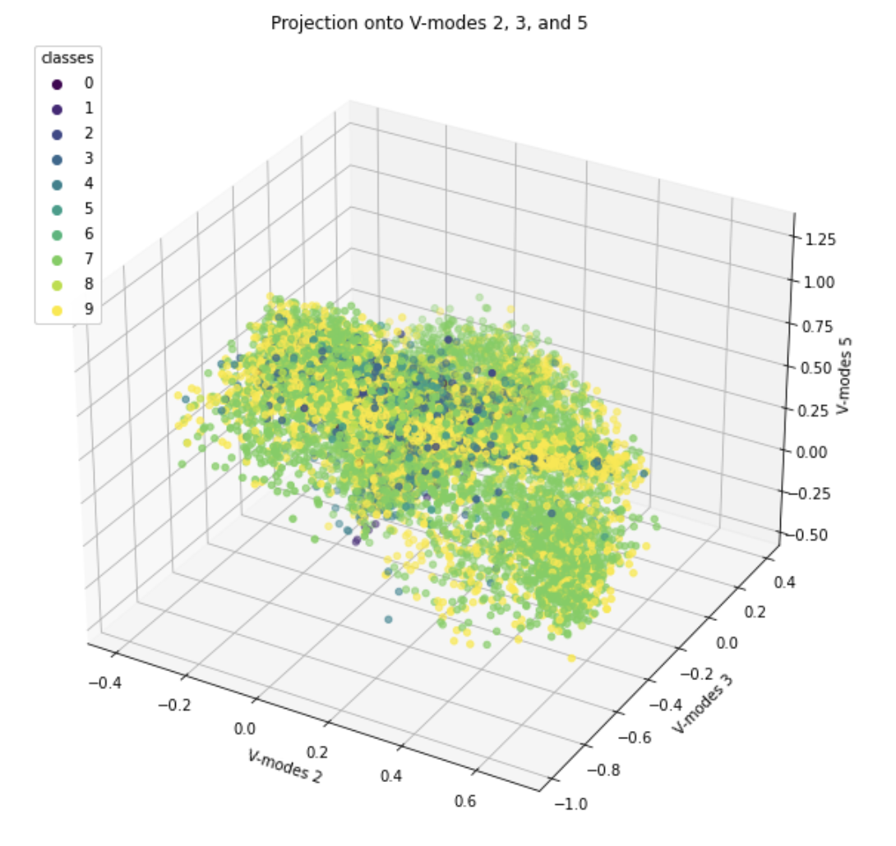

# EE399. 
# introduction to machine learning. 
# HW3. 

## Analysis on MNIST data
Author: Arvin Nusalim. 

Abstruct: Given a 70000 images of 28 X 28 pixel of digit from 0 to 9, perform an analysis of the MNIST data set. Perform SVD on the data set and On a 3D plot, project onto three selected V-modes (columns) colored by their digit label. After projecting the data set into PCA space, build 3 classifiers to identify individual digits. the 3 classifiers are Linear Discriminant Analysis (LDA), Support Vector Machines (SVM), and Decision Tree.

## I. Introduction and Overview.   
This project's objective are to build 3 classifiers to be used on the given data. the 3 classifiers are Linear Discriminant Analysis (LDA), Support Vector Machines (SVM), and Decision Tree. These classifiers will produce different accuracy in separating the 10 digits.

## II. Theoritical Background. 
In this section, we will provide a brief theoretical background on the 3 classifiers (LDA, SVM, and Decision Tree) which are used to clasify the MNIST data and Singular Value Decomposition (SVD). 

### 1. Linear Discriminant Analysis (LDA)
Linear Discriminant Analysis (LDA) is a supervised learning algorithm for classification. It find linear combination and feature that best separate the classes in the data. This can be done by maximizing the between-class variance and minimizing the within-class variance of the data. LDA is a method that assumes that the classes are normally distributed and the covariance matrices of the classes are equal.

### 2. Support Vector Machines (SVM)
Support Vector Machine (SVM) is a supervised learning algorithm that find a hyperplane in an N-dimensional space (N = number of features) that distinctly classifies the data points. firstly, it maps the data into a higher-dimentional feature space usng kernel function where the data will likely be more linearly separable in the higher dimension. Then, it find the best hyperplane that maximizes the margin between the classes in this higher-dimensional space. Although it is effective for high-dimentinal data, SVM can be computational expensive.

### 3. Decision Tree
Decision tree is a supervised machine learning alogrithm that uses a decision tree to classify new data points into several possible categories. This can be built by training on the labeled dataset. The decision tree is constructed by recursively partitioning the feature space into smaller regions based on the values of different features. When new data point is presented, it is classified by traversing the desition tree until it reach the leaf node, and then assign the label to the data point.

### SVD
Singular Value Decomposition (SVD) is a method to break down a matrix into 3 parts that describe its most important features which are diagonal matrix ($\Sigma$ or S) and 2 orthogonal matrices ($U$ and $V^T$). The matrix $\Sigma$ contains the singular values of X, which represent the amount of variance captured by each singular vector. The matrix $U$ contains the left singular vectors of X, which correspond to the directions of maximum variance in the row space of X. The matrix $V^T$ contains the right singular vectors of X, which correspond to the directions of maximum variance in the column space of X.    


## III. Algorithm Implementation and Development. 
### Fetch, reshape, and SVD the MNIST data
to fetch the MNIST data, we can use
```
from sklearn.datasets import fetch_openml
mnist = fetch_openml('mnist_784')
X = mnist.data.astype('float32')
X /= 255.0
y = mnist.target.astype('int32')
```
after getting the dataset, we need to reshape each image into column vector by transposing the data. Finally, we can SVD the data by using 
``` 
U, s, Vt = np.linalg.svd(X_col, full_matrices=False)
```

### Project onto three selected V-modes (columns) colored by their digit label on a 3D plot
to project onto three selected V-modes, pick 3 digits, in this case, we pick digit 2, 3, and 5. we can then project into V-modes by using this code
```
V_proj = Vt[:, [2, 3, 5]]
# Project the data onto the selected V-modes
X_proj = np.dot(X_col.T, V_proj)
```
to plot in 3D, we can use this code.
```
# Create a 3D plot
fig = plt.figure(figsize=(10,10))
ax = fig.add_subplot(111, projection='3d')

# Plot the points in 3D
scatter = ax.scatter(X_proj[:, 0], X_proj[:, 1], X_proj[:, 2], c = y.astype(int))
legend = ax.legend(*scatter.legend_elements(), title='classes', loc='upper left')
ax.add_artist(legend)
# Add labels to the axes
plt.title('Projection onto V-modes 2, 3, and 5')
ax.set_xlabel('V-modes 2')
ax.set_ylabel('V-modes 3')
ax.set_zlabel('V-modes 5')

# Show the plot
plt.show()
```

### Build a LDA that can identify 2 different digits and 3 different digits
Firstly, we need to project the data into PCA space.
```
pca = PCA(n_components=10)
X_train_pca = pca.fit_transform(X)
```
we can then pick the 2 digit that we want and split into training and testing data.
```
#pick digit 0 and 1
label_0 = 0
label_1 = 1

X_0 = X_train_pca[y == label_0]  
X_1 = X_train_pca[y == label_1]
y_0 = y[y == label_0] 
y_1 = y[y == label_1]

# Split the digit 0 into training and testing sets
X_train0, X_test0, y_train0, y_test0 = train_test_split(X_0, y_0, test_size=0.2, random_state=42)

# Split the digit 1 into training and testing sets
X_train1, X_test1, y_train1, y_test1 = train_test_split(X_1, y_1, test_size=0.2, random_state=42)
```
then we need to stack the data
```
X_train = np.vstack([X_train0, X_train1])
y_train = np.hstack([y_train0, y_train1])
```
finally, we can train the LDA using the training data and predict the label using test data.

```
# Train the LDA model on the training data
lda = LDA()
lda.fit(X_train, y_train)

# Predict the labels for the test data
y_pred0 = lda.predict(X_test0)
y_pred1 = lda.predict(X_test1)


# Compute the accuracy of the classifier on the test set
acc_0 = np.mean(y_pred0 == 0)
acc_1 = np.mean(y_pred1 == 1)
acc = (acc_0 + acc_1) / 2
```
we can do the same for 3 digits to train the LDA classifier and predict the accuracy.  

### using LDA, find the 2 digits that are the hardest to separate and the easiest the separate and count the accuracy
to find the 2 digits that are the hardest and easiest to separate, first of all, we can create all possible pair using `digit_pairs = list(combinations(range(10), 2))`. we can then use for loop the check the accuracy for all the combination, and print the hardest and easiest pair to separate.
```
from itertools import combinations

# Train a binary classifier for each pair of digits
accuracy_scores_LDA = {}
digit_pairs = list(combinations(range(10), 2))

for pair in digit_pairs:
    X_pair = X_train_pca[(y == (pair[0])) | (y == (pair[1]))]
    y_pair = y[(y == (pair[0])) | (y == (pair[1]))]
    
    # Split the whole dataset into training and testing sets
    X_train, X_test, y_train, y_test = train_test_split(X_pair, y_pair, test_size=0.2, random_state=42)
    
    clf = LDA()
    clf.fit(X_train, y_train)
    y_pair_pred = clf.predict(X_test)
    accuracy = accuracy_score(y_test, y_pair_pred)
    accuracy_scores_LDA[pair] = accuracy

# Print the hardest and easiest pairs of digits to separate
hardest_pair = min(accuracy_scores_LDA, key=accuracy_scores.get)
easiest_pair = max(accuracy_scores_LDA, key=accuracy_scores.get)
print('Hardest pair:', hardest_pair, 'Accuracy:', accuracy_scores_LDA[hardest_pair])
print('Easiest pair:', easiest_pair, 'Accuracy:', accuracy_scores_LDA[easiest_pair])
```

### LDA, SVM, and decision tree separate all ten digits
to train the LDA, we can use 
```
clf = LDA()
clf.fit(X_train, y_train)
```

to train the SVM, we can use 
```
clf = svm.SVC(kernel='linear', C=1)
clf.fit(X_train, y_train)
```
to train the decision tree, we can use 
```
clf = DecisionTreeClassifier(max_depth=10)
clf.fit(X_train, y_train)
```
after training all the classifiers, we can predict the accuracy by using
```
# Evaluate the classifier on the test set
y_pred = clf.predict(X_test)
accuracy = accuracy_score(y_test, y_pred)
print('Accuracy:', accuracy)
```

## IV. Computational Results. 

after performing SVD on the dataset and plotting the singular value spectrum, we will get 

as you can see in the figure above, the modes effectiveness are decreassing exponentially. For a good image construction, I think around 100 modes (rank r of the digit space) are enough.


the 3D plot that is projected onto column 2, 3, and 5 from the V-modes is   


another example of this is the 3D plot that is projected onto column 1, 5, and 9 which is 


After training the LDA classifier, to identify 2 different digits, for example if we pick digit 0 and digit 1, we will get the overall percent accuracy of 99.6%. Similar things goes when identifying 3 different digits. for example if we pick digit 0, digit 1, and digit 2, we will get the overall percent accuracy of 95%.

The 3 classifiers separate all ten digits quite well, with the percent accuracy of 77% from LDA, 83.8% fro SVM, and 79.4% fro decision tree.

The 2 digit that are the hardest and easiest to separate are (4, 9) and (0, 1) consecutively according to all 3 classifiers (LDA, SVM, and decision tree). The LDA shows the accuracy of 83.8% for (4, 9) and 99.7% for (0, 1), the SVM shows the accuracy of 83.8% for (4, 9) and 99.9% for (0, 1), and the decision tree shows the accuracy of 85.8% for (4, 9) and 99.7% for (0, 1).

These 3 classifiers produce almost similar result with just slight difference. These bargraph shown below are the accuracy for LDA, SVM, and decision tree consecutively after being sorted.


## V. Summary and Conclusions. 
To conclude, the three classifiers (LDA, SVM, and decision tree) compute a similar accuracy for the MNIST dataset. for MNIST data, personally, while SVM is the best at accuracy, it took a long tome to compute which mean it is computational expensive. I think LDA is the best classifiers as it is the quickest classifier compared to the other classifiers and the accuracy is almost the same as decision tree. 
